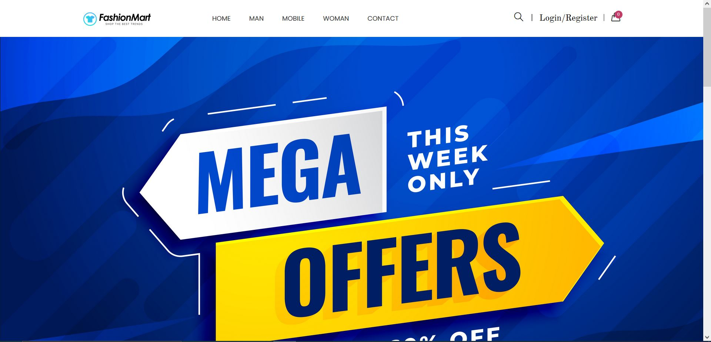
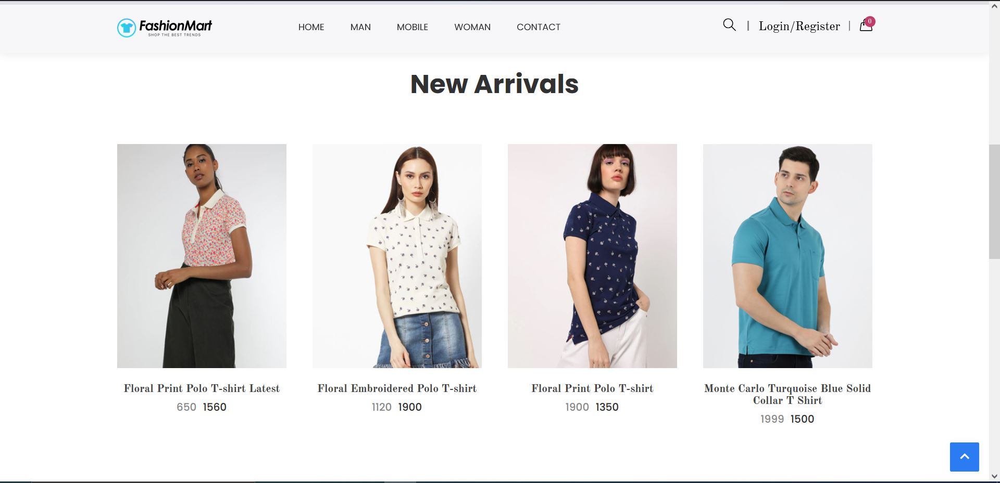
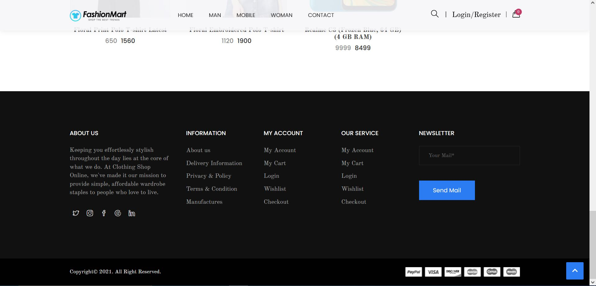
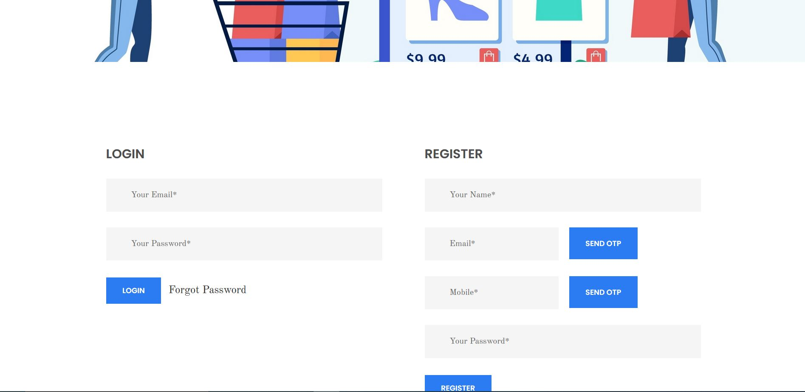
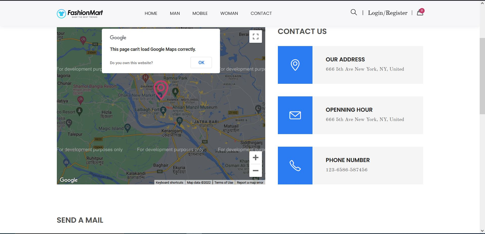
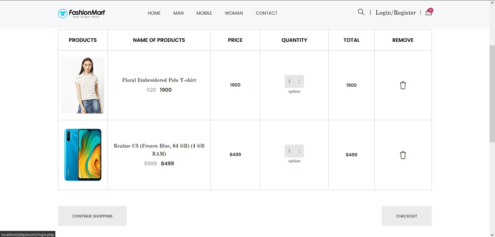
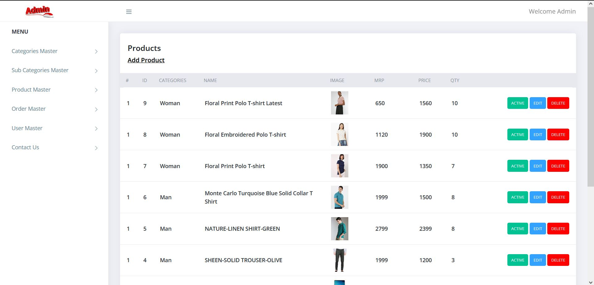

E-commerece website built by using HTML,CSS,JavaScript,Bootstrap,PHP,MySql.

<h3>Homepage<h3>

</img>

</img>

<h3>Footer<h3>
  
</img>

<h3>Login and Sign-up Page<h3>

</img>

<h3>Contact Us Page<h3>

</img>

<h3>My cart</h3>

</img>

<h3>View of Admin Panel and Database</h3>

</img>

<h1>How to run on your local machine</h1>

1. Clone repository using git clone
2. Install xampp/wamp or any other server.
3. Navigate into HTdocs directory in your server's folder e.g.("C:\xampp\htdocs\")
4. Paste "Flipmart" master folder in htdocs folder.
5. Start your apache and sql server in Xampp.
6. Create database named 'ecom' in phpmyadmin on your browser and import sql file given in Flipmart folder to your created database.
7. Go to "localhost/Flipmart".
8. It will be up and running.

